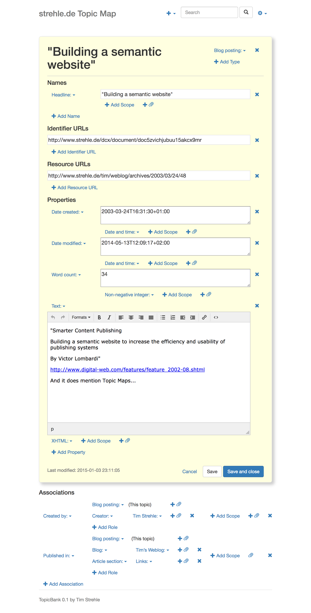

TopicBank (formerly XDDB)
=========================

TMDM experiments in PHP




Install dependencies using Composer:

```
$ cd topicbank
$ docker run --rm --interactive --tty \
  --volume $PWD:/app \
  --volume ${COMPOSER_HOME:-$HOME/.composer}:/tmp \
  composer install
```
